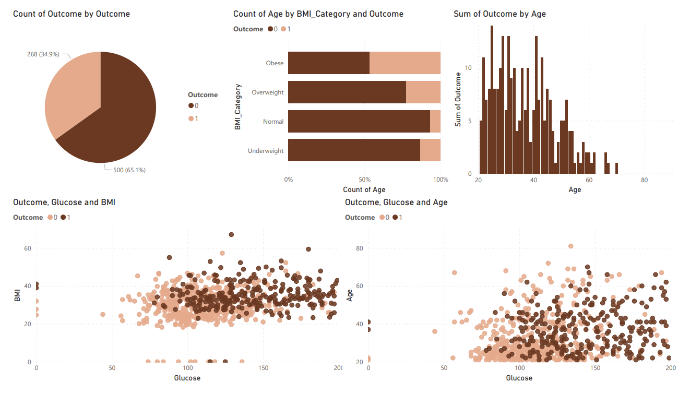

# Diabetes Prediction Insights

## 1️. Diabetes Prevalence
- **65.1%** of the dataset is classified as diabetic (`Outcome = 1`).
- **Visualization Used:** Pie Chart  

## 2. Glucose Levels & Diabetes
- Patients with glucose levels above **120 mg/dL** have a significantly higher chance of being diabetic.
- **Non-diabetic** individuals generally have glucose levels under **60 mg/dL**.
- **Visualization Used:** Scatter Plot  

## 3. Age vs. Diabetes Risk
- Individuals aged **40+** have a higher probability of diabetes compared to younger age groups.
- The highest diabetes occurrence is in the **40-45 age range**.
- **Visualization Used:** Histogram  

## 4️. BMI Impact on Diabetes
- Most diabetic individuals fall into **Overweight (BMI 25-30) and Obese (BMI >30)** categories.
- **Visualization Used:** Bar Chart  

## 5️. Correlation Analysis
- **Glucose and BMI** show a strong correlation with diabetes risk.
- **Blood Pressure has a weaker correlation**.
- **Visualization Used:** Heatmap 

 